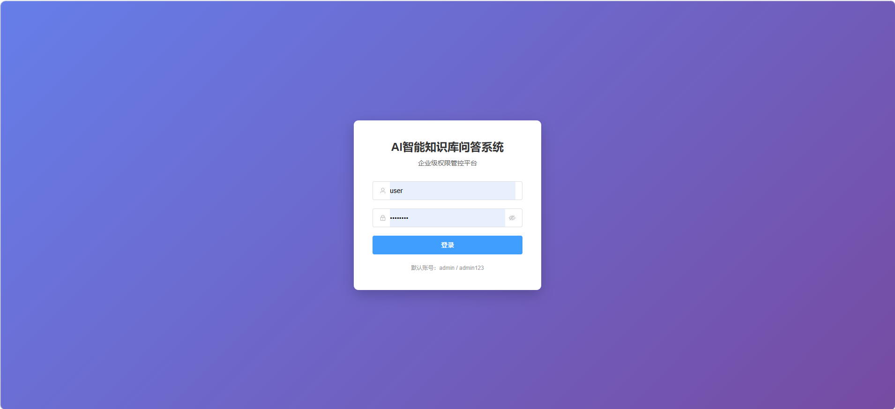
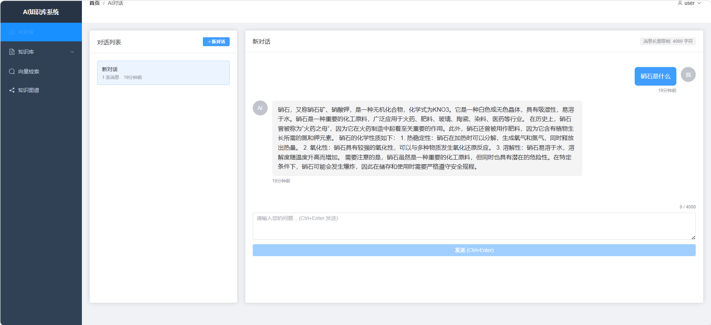
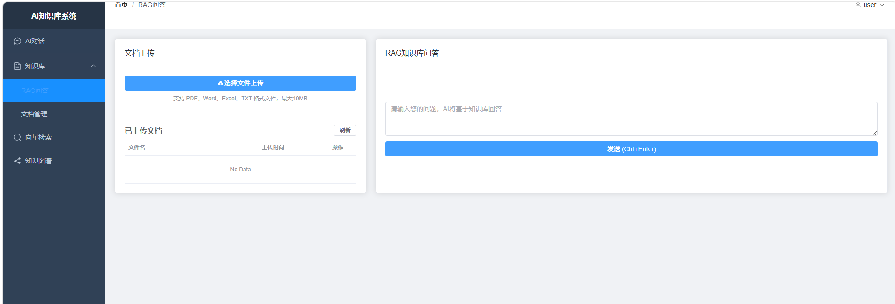
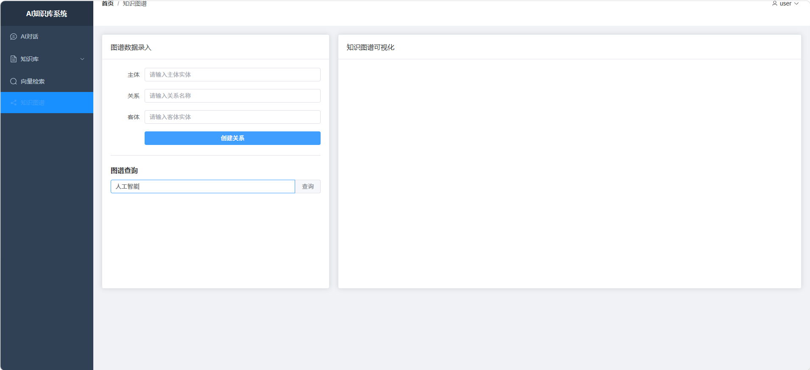
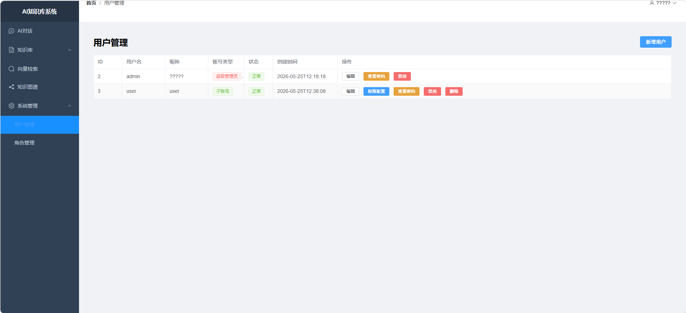

# SmartLink-Knowledge-AI

<div align="center">


**基于 SpringBoot3 + Vue3 的企业级权限管控型AI智能问答系统**

[功能特性](#-功能特性) • [快速开始](#-快速开始) • [截图展示](#-截图展示) • [API文档](#-api文档)

</div>

---

## 📖 项目简介

SmartLink-Knowledge-AI 是一套完整的**企业级AI知识库问答系统**，整合了RBAC权限体系、大模型对话、RAG知识库、向量检索、知识图谱等核心能力，适用于企业知识管理、智能客服、技术文档问答等场景。

## ✨ 功能特性

### 🔐 权限体系
- RBAC权限模型，支持主账号/子账号分级管理
- 菜单权限、按钮权限、接口权限、数据权限四级管控
- 动态路由、动态菜单、按钮级权限控制
- JWT令牌认证，支持Redis缓存

### 🤖 AI对话
- 通用大模型对话（支持智谱AI、OpenAI、通义千问等）
- 多轮对话上下文记忆（最近20轮）
- 对话历史记录管理，支持多会话切换
- 消息长度限制（业内标准4000字符）

### 📚 RAG知识库
- 支持PDF、Word、Excel、TXT文档上传
- 文档自动解析、分块、向量化
- 基于Milvus的语义相似度检索
- 带溯源引用的智能问答

### 🔍 向量检索
- 独立的向量语义检索演示
- 支持TopN相似文档返回
- 余弦相似度计算

### 🕸️ 知识图谱
- 实体关系创建与管理
- ECharts可视化图谱展示
- 图谱关系查询

## 🛠️ 技术栈

### 后端
| 技术 | 版本 | 说明 |
|------|------|------|
| Spring Boot | 3.2.x | 核心框架 |
| Spring Security | 6.x | 安全框架 |
| Spring Data JPA | - | ORM框架 |
| JWT (jjwt) | 0.12.x | 令牌认证 |
| MySQL | 8.0 | 关系数据库 |
| Redis | 7.x | 缓存（可选） |
| Milvus Lite | - | 向量数据库 |
| Neo4j | 5.x | 图数据库（可选） |

### 前端
| 技术 | 版本 | 说明 |
|------|------|------|
| Vue | 3.4.x | 前端框架 |
| Vite | 5.x | 构建工具 |
| Element Plus | 2.6.x | UI组件库 |
| ECharts | 5.5.x | 图表可视化 |
| Axios | 1.6.x | HTTP客户端 |
| Vue Router | 4.3.x | 路由管理 |
| Pinia | 2.1.x | 状态管理 |

## 📸 截图展示

<div align="center">

### 登录页面


### AI对话


### RAG知识库


### 知识图谱


### 用户管理


</div>

## 📁 项目结构

```
SmartLink-Knowledge-AI/
├── backend/                        # 后端SpringBoot项目
│   ├── src/main/java/com/ai/knowledge/
│   │   ├── config/                 # 配置类
│   │   ├── controller/             # 控制器
│   │   ├── dto/                    # 数据传输对象
│   │   ├── entity/                 # 实体类
│   │   ├── repository/             # 数据访问层
│   │   ├── security/               # 安全相关（JWT、过滤器）
│   │   ├── service/                # 业务逻辑层
│   │   └── util/                   # 工具类
│   └── pom.xml
├── frontend/                       # 前端Vue3项目
│   ├── src/
│   │   ├── router/                 # 路由配置
│   │   ├── utils/                  # 工具函数
│   │   └── views/                  # 页面组件
│   └── package.json
├── milvus-service/                 # Milvus向量服务（Python）
│   ├── main.py
│   └── requirements.txt
├── screenshots/                    # 项目截图
├── init-permission.sql             # 权限数据库初始化脚本
├── .env.example                    # 环境变量模板
├── LICENSE                         # MIT开源许可证
└── README.md
```

## 🚀 快速开始

### 环境要求

- JDK 17+
- Node.js 18+
- MySQL 8.0+
- Python 3.10+（用于Milvus向量服务）
- Maven 3.6+

### 1. 克隆项目

```bash
git clone https://github.com/distiong/SmartLink-Knowledge-AI.git
cd SmartLink-Knowledge-AI
```

### 2. 配置环境变量

```bash
# 复制环境变量模板
cp .env.example .env

# 编辑 .env 文件，填入你的配置
```

主要配置项：
```env
# 数据库
DB_USERNAME=root
DB_PASSWORD=your_password

# AI大模型API（以智谱AI为例）
AI_API_KEY=your_api_key
AI_BASE_URL=https://open.bigmodel.cn/api/paas/v4
AI_MODEL=GLM-4-Flash
```

### 3. 初始化数据库

```bash
# 创建数据库
mysql -u root -p -e "CREATE DATABASE knowledge_base DEFAULT CHARACTER SET utf8mb4 COLLATE utf8mb4_unicode_ci;"

# 初始化表结构和数据
mysql -u root -p knowledge_base < init-permission.sql
```

### 4. 启动Milvus向量服务

```bash
cd milvus-service
pip install -r requirements.txt
python main.py
```

### 5. 启动后端

```bash
cd backend
mvn spring-boot:run
```

### 6. 启动前端

```bash
cd frontend
npm install
npm run dev
```

### 7. 访问系统

| 服务 | 地址 |
|------|------|
| 前端 | http://localhost:3000 |
| 后端API | http://localhost:8080 |
| Milvus服务 | http://localhost:8081 |

### 默认账号

| 用户名 | 密码 | 角色 |
|--------|------|------|
| admin | admin123 | 超级管理员 |

## 📝 API文档

### 认证接口

| 方法 | 路径 | 说明 |
|------|------|------|
| POST | /api/auth/login | 用户登录 |
| GET | /api/auth/info | 获取当前用户信息 |
| GET | /api/auth/menu | 获取用户菜单 |
| GET | /api/auth/permissions | 获取用户权限列表 |

### AI对话接口

| 方法 | 路径 | 说明 |
|------|------|------|
| POST | /api/ai/chat | 发送消息（支持多轮上下文） |
| GET | /api/ai/sessions | 获取会话列表 |
| GET | /api/ai/sessions/{id}/messages | 获取会话消息历史 |
| POST | /api/ai/sessions | 创建新会话 |
| DELETE | /api/ai/sessions/{id} | 删除会话 |

### RAG知识库接口

| 方法 | 路径 | 说明 |
|------|------|------|
| POST | /api/rag/upload | 上传文档（PDF/Word/Excel/TXT） |
| GET | /api/rag/chat | RAG智能问答 |
| GET | /api/rag/search | 向量语义检索 |

### 知识图谱接口

| 方法 | 路径 | 说明 |
|------|------|------|
| POST | /api/graph/create | 创建实体关系 |
| GET | /api/graph/query | 查询实体关系 |

### 用户管理接口（管理员）

| 方法 | 路径 | 说明 |
|------|------|------|
| GET | /api/user/list | 获取用户列表 |
| POST | /api/user | 创建用户 |
| PUT | /api/user/{id} | 更新用户信息 |
| DELETE | /api/user/{id} | 删除用户 |
| GET | /api/user/{id}/permissions | 获取用户权限 |
| POST | /api/user/{id}/permissions | 配置用户权限 |

## 🔧 配置说明

### AI大模型配置

系统支持兼容OpenAI API格式的所有大模型服务：

```yaml
ai:
  api-key: your_api_key
  base-url: https://api.example.com/v1
  model: model-name
```

已测试的AI服务：
| 服务商 | Base URL | 模型示例 |
|--------|----------|----------|
| 智谱AI | https://open.bigmodel.cn/api/paas/v4 | GLM-4-Flash |
| OpenAI | https://api.openai.com | gpt-3.5-turbo |
| 通义千问 | https://dashscope.aliyuncs.com | qwen-turbo |
| 文心一言 | https://aip.baidubce.com | ernie-bot |

### Neo4j配置（可选）

如需使用知识图谱的图数据库功能：

```yaml
neo4j:
  enabled: true
  uri: bolt://localhost:7687
  username: neo4j
  password: your_password
```

## 🤝 贡献指南

欢迎提交Issue和Pull Request！

1. Fork 本仓库
2. 创建特性分支 (`git checkout -b feature/AmazingFeature`)
3. 提交改动 (`git commit -m 'feat: Add some AmazingFeature'`)
4. 推送分支 (`git push origin feature/AmazingFeature`)
5. 打开 Pull Request

## 📄 许可证

本项目基于 MIT 许可证开源 - 查看 [LICENSE](LICENSE) 文件了解详情

## 🙏 致谢

- [Spring Boot](https://spring.io/projects/spring-boot) - 后端框架
- [Vue.js](https://vuejs.org/) - 前端框架
- [Element Plus](https://element-plus.org/) - UI组件库
- [Milvus](https://milvus.io/) - 向量数据库
- [ECharts](https://echarts.apache.org/) - 图表库

---

<div align="center">

**如果这个项目对你有帮助，请给个 ⭐ Star 支持一下！**

</div>
